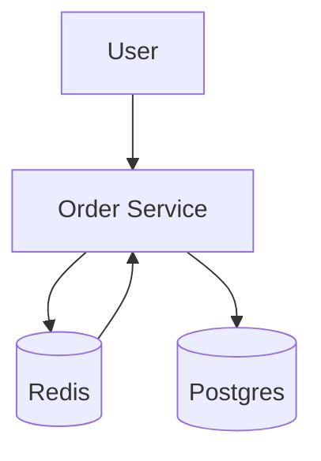

## Демонстрационный сервис заказов

---

Сервис получает данные о заказе из Kafka и сохраняет его в PostgresQl. Пользователь отправляет запрос `GET /{OrderId}` на получение заказа. Если в кэше (Redis) есть данные о заказе, то заказ достаётся из кэша. Иначе данные достаются из базы данных, отправляются пользователю и кэшируются в Redis.

При перезагрузке все данные из PostgresQL кэшируются в Redis

Архитектура приложения

